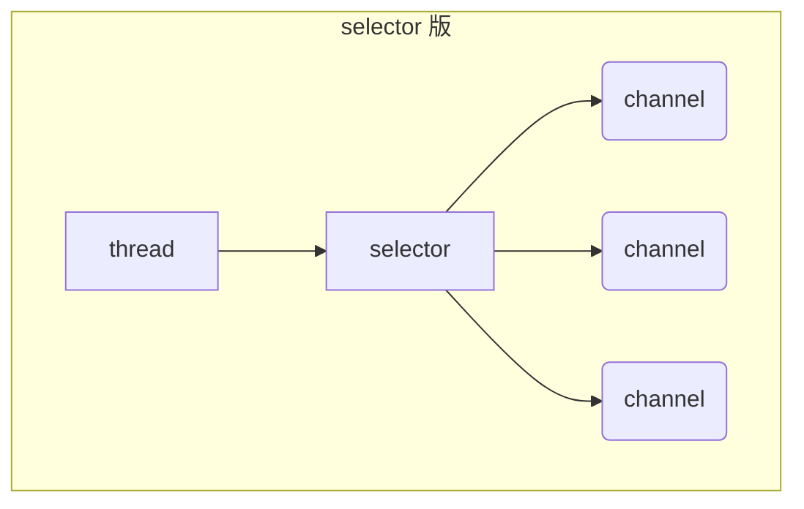

## 4. 网络编程

### 4.1 非阻塞 vs 阻塞

#### 阻塞

* 阻塞模式下，相关方法都会导致线程暂停
  * `ServerSocketChannel.accept` 会在没有连接建立时让线程暂停
  * `SocketChannel.read` 会在没有数据可读时让线程暂停
  * 阻塞的表现其实就是线程暂停了，暂停期间不会占用 cpu，但线程相当于闲置 
* 单线程下，阻塞方法之间相互影响，几乎不能正常工作，需要多线程支持
* 但多线程下，有新的问题，体现在以下方面
  * 32 位 jvm 一个线程 320k，64 位 jvm 一个线程 1024k，如果连接数过多，必然导致 OOM，并且线程太多，反而会因为频繁上下文切换导致性能降低
  * 可以采用线程池技术来减少线程数和线程上下文切换，但治标不治本，如果有很多连接建立，但长时间 inactive，会阻塞线程池中所有线程，因此不适合长连接，只适合短连接

服务器端

```java
// 使用 nio 来理解阻塞模式, 单线程
// 0. ByteBuffer
ByteBuffer buffer = ByteBuffer.allocate(16);
// 1. 创建了服务器
ServerSocketChannel ssc = ServerSocketChannel.open();

// 2. 绑定监听端口
ssc.bind(new InetSocketAddress(8080));

// 3. 连接集合
List<SocketChannel> channels = new ArrayList<>();
while (true) {
    // 4. accept 建立与客户端连接， SocketChannel 用来与客户端之间通信
    log.debug("connecting...");
    SocketChannel sc = ssc.accept(); // 阻塞方法，线程停止运行
    log.debug("connected... {}", sc);
    channels.add(sc);
    for (SocketChannel channel : channels) {
        // 5. 接收客户端发送的数据
        log.debug("before read... {}", channel);
        channel.read(buffer); // 阻塞方法，线程停止运行
        buffer.flip();
        debugRead(buffer);
        buffer.clear();
        log.debug("after read...{}", channel);
    }
}
```

客户端

```java
SocketChannel sc = SocketChannel.open();
sc.connect(new InetSocketAddress("localhost", 8080));
System.out.println("waiting...");
```

这种模式下，当客户端发送了一次数据后，服务器处理通道中的数据后，再次进入循环，会再次被 accept 阻塞。此时之前的客户端再次发送消息，服务端会因为被阻塞而无法处理客户端发送到通道中的消息。

#### 非阻塞

* 非阻塞模式下，相关方法都会不会让线程暂停
  * 在 `ServerSocketChannel.accept` 在没有连接建立时，会返回 null，继续运行
  * `SocketChannel.read` 在没有数据可读时，会返回 0，但线程不必阻塞，可以去执行其它 SocketChannel 的 read 或是去执行 `ServerSocketChannel.accept` 
  * 写数据时，线程只是等待数据写入 Channel 即可，无需等 Channel 通过网络把数据发送出去
* 但非阻塞模式下，即使没有连接建立，和可读数据，线程仍然在不断运行，白白浪费了 cpu
* 数据复制过程中，线程实际还是阻塞的（AIO 改进的地方）

设置：

* 可以通过 ServerSocketChannel 的` configureBlocking(false)` 方法将获得连接设置为非阻塞的。此时若没有连接，accept 会返回 null
* 可以通过 SocketChannel 的 `configureBlocking(false)` 方法将从通道中读取数据设置为非阻塞的。若此时通道中没有数据可读，read 会返回 -1

服务器端，客户端代码不变

```java{6,13,16,21}
// 使用 nio 来理解非阻塞模式, 单线程
// 0. ByteBuffer
ByteBuffer buffer = ByteBuffer.allocate(16);
// 1. 创建了服务器
ServerSocketChannel ssc = ServerSocketChannel.open();
ssc.configureBlocking(false); // 非阻塞模式
// 2. 绑定监听端口
ssc.bind(new InetSocketAddress(8080));
// 3. 连接集合
List<SocketChannel> channels = new ArrayList<>();
while (true) {
    // 4. accept 建立与客户端连接， SocketChannel 用来与客户端之间通信
    SocketChannel sc = ssc.accept(); // 非阻塞，线程还会继续运行，如果没有连接建立，但sc是null
    if (sc != null) {
        log.debug("connected... {}", sc);
        sc.configureBlocking(false); // 非阻塞模式 => 能让下面的 read 变为非阻塞
        channels.add(sc);
    }
    for (SocketChannel channel : channels) {
        // 5. 接收客户端发送的数据
        int read = channel.read(buffer);// 非阻塞，线程仍然会继续运行，如果没有读到数据，read 返回 0
        if (read > 0) {
            buffer.flip();
            debugRead(buffer);
            buffer.clear();
            log.debug("after read...{}", channel);
        }
    }
}
```

以上模式为同步非阻塞，并非 NIO 模式。

#### 多路复用

单线程可以配合 Selector 完成对多个 Channel 可读写事件的监控，这称之为多路复用

* <font color='red'>多路复用仅针对网络 IO，普通文件 IO 没法利用多路复用</font>
* 如果不用 Selector 的非阻塞模式，线程大部分时间都在做无用功，而 Selector 能够保证
  * 有可连接事件时才去连接
  * 有可读事件才去读取
  * 有可写事件才去写入
    * 限于网络传输能力，Channel 未必时时可写，一旦 Channel 可写，会触发 Selector 的可写事件

Selector：非阻塞 + 事件，当没有事件发生的时候，还是阻塞的，不会让线程空运行

### 4.2 Selector 及其使用



好处

* 一个线程配合 selector 就可以监控多个 channel 的事件，事件发生线程才去处理。避免非阻塞模式下所做无用功
* 让这个线程能够被充分利用
* 节约了线程的数量
* 减少了线程上下文切换

::: tip 事件类型

- accept：服务端，在有连接请求时触发
- connnect： 客户端，连接被服务端建立后触发
- read：可读事件
- write：可写事件

:::

> 要在遍历集合时还要删除，要用迭代器做。不要用增强 for 做。

#### 创建

```java
Selector selector = Selector.open();
```

#### 绑定 Channel 事件

也称之为**注册事件**，绑定的事件 selector 才会关心 

```java
channel.configureBlocking(false);
SelectionKey key = channel.register(selector, 绑定事件);
```

* channel 必须工作在非阻塞模式
* FileChannel 没有非阻塞模式，因此不能配合 selector 一起使用
* 绑定的事件类型可以有
  * connect - 客户端连接成功时触发
  * accept - 服务器端成功接受连接时触发
  * read - 数据可读入时触发，有因为接收能力弱，数据暂不能读入的情况
  * write - 数据可写出时触发，有因为发送能力弱，数据暂不能写出的情况

#### 监听 Channel 事件

可以通过下面三种方法来监听是否有事件发生，方法的返回值代表有多少 channel 发生了事件

方法1，阻塞直到绑定事件发生

```java
int count = selector.select();
```

方法2，阻塞直到绑定事件发生，或是超时（时间单位为 ms）

```java
int count = selector.select(long timeout);
```

方法3，不会阻塞，也就是不管有没有事件，立刻返回，自己根据返回值检查是否有事件

```java
int count = selector.selectNow();
```

#### 💡 select 何时不阻塞

> * 事件发生时
>   * 客户端发起连接请求，会触发 accept 事件
>   * 客户端发送数据过来，客户端<font color='red'>正常、异常关闭时，都会触发 read 事件</font>，另外如果发送的数据大于 buffer 缓冲区，会触发<font color='red'>多次读取事件</font>
>   * channel 可写，会触发 write 事件
>   * 在 linux 下 nio bug 发生时
> * 调用 selector.wakeup()
> * 调用 selector.close()
> * selector 所在线程 interrupt

#### 一些注意事项

- 有未处理事件时，select 是不会阻塞的，所以事件发生后，要么处理 要么取消（`key.cancel()`），不能置之不理。
- NIO 中，拿到一个 Key 时，一定要及时给他删掉，因为 selectedKeys 集合中不会删除元素，只会将对应 key 发生的事件删掉，而不会删掉这个key，这样下次处理时拿到这个key就会对一个空事件进行操作了，会出问题。
- 客户端断开连接问题：
  - 客户端断开连接也会产生一个read事件， 会产生一个 Key 放在 selectedKeys 集合中，若不对其处理，会导致服务端一直循环读到该key。
  - 上述情况出现在强制断开和正常调用 `sc.close()` 方法时都会出现。但正常断开时，不能通过异常捕捉到，需通过 read 时的返回结果为 -1 进行判断。
- 消息过长
  - 消息长度超过channel 分配的空间时，一次读不完就会触发第二次读取，不会报错，直接把第二次读取到的内容作为一个完整的消息进行处理。  =⇒  ByteBuffer 不能是局部变量，必须在两次读取时都调用同一个buffer共享数据。
- 写入内容
  - 写入内容过多时，会导致发送数据的写缓冲区变满，此时若线程无法处理其他事件，则影响效率。
  - 没有数据可写了就不要把 buffer 关联在 key 上了，会占用很大的内存。所以需要清理操作 ⇒ 取消关联 && 取消关注可写事件。
> 可写事件：写缓冲区有空余了，可以写新内容了。

### 4.3 accept 事件处理

客户端代码为

```java
public class Client {
    public static void main(String[] args) {
        try (Socket socket = new Socket("localhost", 8080)) {
            System.out.println(socket);
            socket.getOutputStream().write("world".getBytes());
            System.in.read();
        } catch (IOException e) {
            e.printStackTrace();
        }
    }
}
```

服务器端代码为

```java
@Slf4j
public class ChannelDemo6 {
    public static void main(String[] args) {
        // 获得服务器通道
        try (ServerSocketChannel channel = ServerSocketChannel.open()) {
            channel.bind(new InetSocketAddress(8080));
            // 创建选择器
            Selector selector = Selector.open();
            // 通道必须设置为非阻塞模式
            channel.configureBlocking(false);
            // 将通道注册到选择器中，并设置感兴趣的事件
            channel.register(selector, SelectionKey.OP_ACCEPT);

            while (true) {
                // 若没有事件就绪，线程会被阻塞，反之不会被阻塞。从而避免了CPU空转
                // 返回值为就绪的事件个数
                int count = selector.select();
//                int count = selector.selectNow();
                log.debug("select count: {}", count);

                // 获取所有事件
                Set<SelectionKey> keys = selector.selectedKeys();

                // 使用迭代器遍历事件
                Iterator<SelectionKey> iter = keys.iterator();
                while (iter.hasNext()) {
                    SelectionKey key = iter.next();
                    // 判断事件类型
                    if (key.isAcceptable()) {
                        ServerSocketChannel c = (ServerSocketChannel) key.channel();
                        // 获取连接并处理，而且是必须处理，否则需要取消
                        SocketChannel sc = c.accept();
                        log.debug("{}", sc);
                    }
                    // 处理完毕，必须将事件移除
                    iter.remove();
                }
            }
        } catch (IOException e) {
            e.printStackTrace();
        }
    }
}
```

#### 💡 事件发生后能否不处理

> 事件发生后，要么处理，要么取消（cancel），不能什么都不做，否则下次该事件仍会触发，这是因为 nio 底层使用的是水平触发
> 事件的处理：上述代码中包含 `SocketChannel sc = c.accept();` 的 if 语句块就是处理。
> 或者 `key.cancle()` 也是处理。

### 4.4  read 事件处理

- 在 Accept 事件中，若有客户端与服务器端建立了连接，需要将其对应的 SocketChannel 设置为非阻塞，并注册到选择其中
- 添加Read事件，触发后进行读取操作

```java
@Slf4j
public class ChannelDemo6 {
    public static void main(String[] args) {
        // 获得服务器通道
        try (ServerSocketChannel channel = ServerSocketChannel.open()) {
            channel.bind(new InetSocketAddress(8080));
             // 创建选择器
            Selector selector = Selector.open();
            // 通道必须设置为非阻塞模式
            channel.configureBlocking(false);
            // 将通道注册到选择器中，并设置感兴趣的事件
            channel.register(selector, SelectionKey.OP_ACCEPT);

            while (true) {
                // 若没有事件就绪，线程会被阻塞，反之不会被阻塞。从而避免了CPU空转
                // 返回值为就绪的事件个数
                int count = selector.select();
//                int count = selector.selectNow();
                log.debug("select count: {}", count);

                // 获取所有事件
                Set<SelectionKey> keys = selector.selectedKeys();

                // 使用迭代器遍历事件
                Iterator<SelectionKey> iter = keys.iterator();
                while (iter.hasNext()) {
                    SelectionKey key = iter.next();
                    // 判断事件类型
                    if (key.isAcceptable()) {
                        // 获得key对应的channel
                        ServerSocketChannel c = (ServerSocketChannel) key.channel();
                        // 获取连接
                        SocketChannel sc = c.accept();
                        // 设置为非阻塞模式
                        sc.configureBlocking(false);
                        // 将连接的通道也注册到选择器中
                        sc.register(selector, SelectionKey.OP_READ);
                        log.debug("连接已建立: {}", sc);
                    } else if (key.isReadable()) {
                        SocketChannel sc = (SocketChannel) key.channel();
                        ByteBuffer buffer = ByteBuffer.allocate(128); // 这里的 buffer 不能定义为全局的，因为多个客户端可能会公用一个buffer 而冲突
                        int read = sc.read(buffer);
                        if(read == -1) {
                            key.cancel();
                            sc.close();
                        } else {
                            buffer.flip();
                            debug(buffer);
                        }
                    }
                    // 处理完毕，必须将事件移除
                    iter.remove();
                }
            }
        } catch (IOException e) {
            e.printStackTrace();
        }
    }
}
```

开启两个客户端，修改一下发送文字，输出

```
sun.nio.ch.ServerSocketChannelImpl[/0:0:0:0:0:0:0:0:8080]
21:16:39 [DEBUG] [main] c.i.n.ChannelDemo6 - select count: 1
21:16:39 [DEBUG] [main] c.i.n.ChannelDemo6 - 连接已建立: java.nio.channels.SocketChannel[connected local=/127.0.0.1:8080 remote=/127.0.0.1:60367]
21:16:39 [DEBUG] [main] c.i.n.ChannelDemo6 - select count: 1
         +-------------------------------------------------+
         |  0  1  2  3  4  5  6  7  8  9  a  b  c  d  e  f |
+--------+-------------------------------------------------+----------------+
|00000000| 68 65 6c 6c 6f                                  |hello           |
+--------+-------------------------------------------------+----------------+
21:16:59 [DEBUG] [main] c.i.n.ChannelDemo6 - select count: 1
21:16:59 [DEBUG] [main] c.i.n.ChannelDemo6 - 连接已建立: java.nio.channels.SocketChannel[connected local=/127.0.0.1:8080 remote=/127.0.0.1:60378]
21:16:59 [DEBUG] [main] c.i.n.ChannelDemo6 - select count: 1
         +-------------------------------------------------+
         |  0  1  2  3  4  5  6  7  8  9  a  b  c  d  e  f |
+--------+-------------------------------------------------+----------------+
|00000000| 77 6f 72 6c 64                                  |world           |
+--------+-------------------------------------------------+----------------+
```

#### 💡 为何要 iter.remove()

> 因为 select 在事件发生后，就会将相关的 key 放入 selectedKeys 集合，但不会在处理完后从 selectedKeys 集合中移除，需要我们自己编码删除。例如
>
> * 第一次触发了 ssckey 上的 accept 事件，没有移除 ssckey 
> * 第二次触发了 sckey 上的 read 事件，但这时 selectedKeys 中还有上次的 ssckey ，在遍历处理时因为没有真正的 serverSocket 连上了，就会导致空指针异常

#### 💡 cancel 的作用

> cancel 会取消注册在 selector 上的 channel，并从 keys 集合中删除 key 后续不会再监听事件

#### 断开处理

当客户端与服务器之间的**连接断开时，会给服务器端发送一个读事件**，对异常断开和正常断开需要加以不同的方式进行处理。

- 正常断开
  - 正常断开时，服务器端的 `channel.read(buffer)` 方法的返回值为-1，所以当结束到返回值为-1时，需要调用 key 的 cancel 方法取消此事件，并在取消后移除该事件

```java
int read = channel.read(buffer);
// 断开连接时，客户端会向服务器发送一个写事件，此时read的返回值为-1
if(read == -1) {
    // 取消该事件的处理
	key.cancel();
    channel.close();
} else {
    ...
}
// 取消或者处理，都需要移除key
iterator.remove();
```

- 异常断开
  - 异常断开时，会抛出IOException异常， 在try-catch的**catch块中捕获异常并调用key的cancel方法即可**

#### 消息边界处理

**不处理消息边界存在的问题：**

将缓冲区的大小设置为4个字节，发送2个汉字（你好），通过decode解码并打印时，会出现乱码

```java
ByteBuffer buffer = ByteBuffer.allocate(4);
// 解码并打印
System.out.println(StandardCharsets.UTF_8.decode(buffer));
```

```text
你�
��
```

这是因为UTF-8字符集下，1个汉字占用3个字节，此时缓冲区大小为4个字节，一次读时间无法处理完通道中的所有数据，所以一共会触发两次读事件。这就导致 你好 的 好 字被拆分为了前半部分和后半部分发送，解码时就会出现问题

**处理消息边界：**

传输的文本可能有以下三种情况：

- 文本大于缓冲区大小
  - 此时需要将缓冲区进行扩容
- 发生半包现象
- 发生粘包现象

<center></center>

解决思路大致有以下三种：

- 固定消息长度，数据包大小一样，服务器按预定长度读取，当发送的数据较少时，需要将数据进行填充，直到长度与消息规定长度一致。缺点是浪费带宽
- 另一种思路是按分隔符拆分，缺点是效率低，需要一个一个字符地去匹配分隔符
- TLV 格式，即 Type 类型、Length 长度、Value 数据（也就是在消息开头用一些空间存放后面数据的长度），如HTTP请求头中的 Content-Type 与 Content-Length。类型和长度已知的情况下，就可以方便获取消息大小，分配合适的 buffer，缺点是 buffer 需要提前分配，如果内容过大，则影响 server 吞吐量
  - Http 1.1 是 TLV 格式
  - Http 2.0 是 LTV 格式
  
<font color='blue'>下文的消息边界处理方式为第二种：按分隔符拆分</font>

**附件与扩容**

Channel 的 register 方法还有第三个参数：`attachment`，可以向其中放入一个 Object 类型的对象，该对象会与登记的 Channel 以及其对应的 SelectionKey 绑定，可以从 SelectionKey 获取到对应通道的附件.

```java
public final SelectionKey register(Selector sel, int ops, Object att)
```

可通过 SelectionKe 的 attachment() 方法获得附件:

```java
ByteBuffer buffer = (ByteBuffer) key.attachment();
```

我们需要在 <font color='red'>Accept 事件发生后</font>，将通道注册到 Selector 中时，对每个通道添加一个 ByteBuffer 附件，<font color='red'>让每个通道发生读事件时都使用自己的通道</font>，避免与其他通道发生冲突而导致问题.

```java{5}
// 设置为非阻塞模式，同时将连接的通道也注册到选择其中，同时设置附件
socketChannel.configureBlocking(false);
ByteBuffer buffer = ByteBuffer.allocate(16);
// 添加通道对应的Buffer附件
socketChannel.register(selector, SelectionKey.OP_READ, buffer);
```

当 Channel 中的数据大于缓冲区时，需要对缓冲区进行**扩容**操作。

此代码中的**扩容的判定方法：** Channel 调用 compact 方法后，position 与 limit 相等，说明缓冲区中的数据并未被读取（容量太小），此时创建新的缓冲区，其大小扩大为两倍。同时还要将旧缓冲区中的数据拷贝到新的缓冲区中，同时调用 SelectionKey 的 attach 方法将新的缓冲区作为新的附件放入 SelectionKey 中

```java
// 如果缓冲区太小，就进行扩容
if (buffer.position() == buffer.limit()) {
    ByteBuffer newBuffer = ByteBuffer.allocate(buffer.capacity()*2);
    // 将旧buffer中的内容放入新的buffer中
    ewBuffer.put(buffer);
    // 将新buffer作为附件放到key中
    key.attach(newBuffer);
}
```

**改造后的服务器代码如下:**

```java
public class SelectServer {
    public static void main(String[] args) {
        // 获得服务器通道
        try(ServerSocketChannel server = ServerSocketChannel.open()) {
            server.bind(new InetSocketAddress(8080));
            // 创建选择器
            Selector selector = Selector.open();
            // 通道必须设置为非阻塞模式
            server.configureBlocking(false);
            // 将通道注册到选择器中，并设置感兴趣的事件
            server.register(selector, SelectionKey.OP_ACCEPT);
            // 为serverKey设置感兴趣的事件
            while (true) {
                // 若没有事件就绪，线程会被阻塞，反之不会被阻塞。从而避免了CPU空转
                // 返回值为就绪的事件个数
                int ready = selector.select();
                System.out.println("selector ready counts : " + ready);
                // 获取所有事件
                Set<SelectionKey> selectionKeys = selector.selectedKeys();
                // 使用迭代器遍历事件
                Iterator<SelectionKey> iterator = selectionKeys.iterator();
                while (iterator.hasNext()) {
                    SelectionKey key = iterator.next();
                    // 及时移除
                    iterator.remove();
                    // 判断key的类型
                    if(key.isAcceptable()) {
                        // 获得key对应的channel
                        ServerSocketChannel channel = (ServerSocketChannel) key.channe();
                        System.out.println("before accepting...");
                        // 获取连接
                        SocketChannel socketChannel = channel.accept();
                        System.out.println("after accepting...");
                        // 设置为非阻塞模式，同时将连接的通道也注册到选择其中，同时设置附件
                        socketChannel.configureBlocking(false);
                        ByteBuffer buffer = ByteBuffer.allocate(16);
                        socketChannel.register(selector, SelectionKey.OP_READ, buffer);
                        // // 处理完毕后移除
                        // iterator.remove();
                    } else if (key.isReadable()) {
                        SocketChannel channel = (SocketChannel) key.channel();
                        System.out.println("before reading...");
                        // 通过key获得附件（buffer）
                        ByteBuffer buffer = (ByteBuffer) key.attachment();
                        int read = channel.read(buffer);
                        if(read == -1) {
                            key.cancel();
                            channel.close();
                        } else {
                            // 通过分隔符来分隔buffer中的数据
                            split(buffer);
                            // 如果缓冲区太小，就进行扩容
                            if (buffer.position() == buffer.limit()) {
                                ByteBuffer newBuffer = ByteBuffer.allocate(buffer.capacity()*2);
                                // 将旧buffer中的内容放入新的buffer中
                                buffer.flip();
                                newBuffer.put(buffer);
                                // 将新buffer放到key中作为附件
                                key.attach(newBuffer);
                            }
                        }
                        System.out.println("after reading...");
                    }
                }
            }
        } catch (IOException e) {
            e.printStackTrace();
        }
    }

    private static void split(ByteBuffer buffer) {
        buffer.flip();
        for(int i = 0; i < buffer.limit(); i++) {
            // 遍历寻找分隔符
            // get(i)不会移动position
            if (buffer.get(i) == '\n') {
                // 缓冲区长度
                int length = i+1-buffer.position();
                ByteBuffer target = ByteBuffer.allocate(length);
                // 将前面的内容写入target缓冲区
                for(int j = 0; j < length; j++) {
                    // 将buffer中的数据写入target中
                    target.put(buffer.get());
                }
                // 打印结果
                ByteBufferUtil.debugAll(target);
            }
        }
        // 切换为写模式，但是缓冲区可能未读完，这里需要使用compact
        buffer.compact();
    }
}
```

#### ByteBuffer 大小分配

- 每个 channel 都需要记录可能被切分的消息，因为 **ByteBuffer 不能被多个 channel 共同使用**，因此需要为每个 channel 维护一个独立的 ByteBuffer
- ByteBuffer 不能太大，比如一个 ByteBuffer 1Mb 的话，要支持百万连接就要 1Tb 内存，因此需要设计大小可变的 ByteBuffer
  - 一种思路是首先分配一个较小的 buffer，例如 4k，如果发现数据不够，再分配 8k 的 buffer，将 4k buffer 内容拷贝至 8k buffer，优点是消息连续容易处理，缺点是数据拷贝耗费性能，参考实现 [http://tutorials.jenkov.com/java-performance/resizable-array.html](http://tutorials.jenkov.com/java-performance/resizable-array.html)
  - 另一种思路是用多个数组组成 buffer，一个数组不够，把多出来的内容写入新的数组，与前面的区别是消息存储不连续解析复杂，优点是避免了拷贝引起的性能损耗

### 4.5 write 事件处理

服务器通过Buffer向通道中写入数据时，可能因为通道容量小于Buffer中的数据大小，导致 `SocketChannel.write(buffer)` 无法一次性将Buffer中的数据全部写入到Channel中，这时便需要分多次写入，具体步骤如下:

1. 执行一次写操作，向将buffer中的内容写入到SocketChannel中，然后判断Buffer中是否还有数据
2. 若Buffer中还有数据，则<font color='blue'>需要将SockerChannel注册到Seletor中，并关注写事件，同时将未写完的Buffer作为附件一起放入到SelectionKey中</font>

```java{6}
int write = socket.write(buffer);
// 通道中可能无法放入缓冲区中的所有数据
if (buffer.hasRemaining()) {
    // 注册到Selector中，关注可写事件，并将buffer添加到key的附件中
    socket.configureBlocking(false);
    socket.register(selector, SelectionKey.OP_WRITE, buffer);
}
```

3. 添加写事件的相关操作 `key.isWritable()`，对Buffer再次进行写操作
  - 每次写后需要判断Buffer中是否还有数据（是否写完）。<font color='blue'>若写完，需要移除SelecionKey中的Buffer附件，避免其占用过多内存，同时还需移除对写事件的关注</font>

```java{9-10}
SocketChannel socket = (SocketChannel) key.channel();
// 获得buffer
ByteBuffer buffer = (ByteBuffer) key.attachment();
// 执行写操作
int write = socket.write(buffer);
System.out.println(write);
// 如果已经完成了写操作，需要移除key中的附件，同时不再对写事件感兴趣
if (!buffer.hasRemaining()) {
    key.attach(null);
    key.interestOps(key.interestOps() - SelectionKey.OP_WRITE);
}
```

**整体代码如下:**

```java
public class WriteServer {

    public static void main(String[] args) throws IOException {
        ServerSocketChannel ssc = ServerSocketChannel.open();
        ssc.configureBlocking(false);
        ssc.bind(new InetSocketAddress(8080));

        Selector selector = Selector.open();
        ssc.register(selector, SelectionKey.OP_ACCEPT);

        while(true) {
            selector.select();

            Iterator<SelectionKey> iter = selector.selectedKeys().iterator();
            while (iter.hasNext()) {
                SelectionKey key = iter.next();
                iter.remove();
                if (key.isAcceptable()) {
                    SocketChannel sc = ssc.accept();
                    sc.configureBlocking(false);
                    SelectionKey sckey = sc.register(selector, SelectionKey.OP_READ);
                    // 1. 向客户端发送内容
                    StringBuilder sb = new StringBuilder();
                    for (int i = 0; i < 3000000; i++) {
                        sb.append("a");
                    }
                    ByteBuffer buffer = Charset.defaultCharset().encode(sb.toString());
                    int write = sc.write(buffer);
                    // 3. write 表示实际写了多少字节
                    System.out.println("实际写入字节:" + write);
                    // 4. 如果有剩余未读字节，才需要关注写事件
                    if (buffer.hasRemaining()) {
                        // read 1  write 4
                        // 在原有关注事件的基础上，多关注 写事件
                        sckey.interestOps(sckey.interestOps() + SelectionKey.OP_WRITE);
                        // 把 buffer 作为附件加入 sckey
                        sckey.attach(buffer);
                    }
                } else if (key.isWritable()) {
                    ByteBuffer buffer = (ByteBuffer) key.attachment();
                    SocketChannel sc = (SocketChannel) key.channel();
                    int write = sc.write(buffer);
                    System.out.println("实际写入字节:" + write);
                    if (!buffer.hasRemaining()) { // 写完了
                        key.interestOps(key.interestOps() - SelectionKey.OP_WRITE);
                        key.attach(null);
                    }
                }
            }
        }
    }
}
```

#### 💡 write 为何要取消

只要向 channel 发送数据时，socket 缓冲可写，这个事件会频繁触发，因此应当只在 socket 缓冲区写不下时再关注可写事件，数据写完之后再取消关注

### 4.6 优化

#### 💡 利用多线程优化

分两组选择器

* 单线程配一个选择器（Boss），专门处理 accept 事件
* 创建 cpu 核心数的线程（Worker），每个线程配一个选择器，轮流处理 read 事件
  * Worker 需要实现 Runnable 接口 ⇒ 新创建线程时执行的方法让他直接在Worker中找

:::tip 两个线程之间传递消息：用消息队列. 

```java
private ConcurrentLinkedQueue<Runnable> queue = new ConcurrentLinkedQueue<>();
```

ConcurrentLinkedQueue 是并发安全的

=⇒ 用队列来解耦，<font color='red'>“队列，就是用来在两个线程间传递消息的”</font>

:::

```java
public class ChannelDemo7 {
    public static void main(String[] args) throws IOException {
        new BossEventLoop().register();
    }

    @Slf4j
    static class BossEventLoop implements Runnable {
        private Selector boss;
        private WorkerEventLoop[] workers;
        private volatile boolean start = false;
        AtomicInteger index = new AtomicInteger();

        public void register() throws IOException {
            if (!start) {
                ServerSocketChannel ssc = ServerSocketChannel.open();
                ssc.bind(new InetSocketAddress(8080));
                ssc.configureBlocking(false);
                boss = Selector.open();
                SelectionKey ssckey = ssc.register(boss, 0, null);
                ssckey.interestOps(SelectionKey.OP_ACCEPT);
                workers = initEventLoops();
                new Thread(this, "boss").start();
                log.debug("boss start...");
                start = true;
            }
        }

        public WorkerEventLoop[] initEventLoops() {
//        EventLoop[] eventLoops = new EventLoop[Runtime.getRuntime().availableProcessors()];
            WorkerEventLoop[] workerEventLoops = new WorkerEventLoop[2];
            for (int i = 0; i < workerEventLoops.length; i++) {
                workerEventLoops[i] = new WorkerEventLoop(i);
            }
            return workerEventLoops;
        }

        @Override
        public void run() {
            while (true) {
                try {
                    boss.select();
                    Iterator<SelectionKey> iter = boss.selectedKeys().iterator();
                    while (iter.hasNext()) {
                        SelectionKey key = iter.next();
                        iter.remove();
                        if (key.isAcceptable()) {
                            ServerSocketChannel c = (ServerSocketChannel) key.channel();
                            SocketChannel sc = c.accept();
                            sc.configureBlocking(false);
                            log.debug("{} connected", sc.getRemoteAddress());
                            workers[index.getAndIncrement() % workers.length].register(sc);
                        }
                    }
                } catch (IOException e) {
                    e.printStackTrace();
                }
            }
        }
    }

    @Slf4j
    static class WorkerEventLoop implements Runnable {
        private Selector worker;
        private volatile boolean start = false;
        private int index;

        private final ConcurrentLinkedQueue<Runnable> tasks = new ConcurrentLinkedQueue<>();

        public WorkerEventLoop(int index) {
            this.index = index;
        }

        public void register(SocketChannel sc) throws IOException {
            if (!start) {
                worker = Selector.open();
                new Thread(this, "worker-" + index).start();
                start = true;
            }
            tasks.add(() -> {
                try {
                    SelectionKey sckey = sc.register(worker, 0, null);
                    sckey.interestOps(SelectionKey.OP_READ);
                    worker.selectNow();
                } catch (IOException e) {
                    e.printStackTrace();
                }
            });
            worker.wakeup();
        }

        @Override
        public void run() {
            while (true) {
                try {
                    worker.select();
                    Runnable task = tasks.poll();
                    if (task != null) {
                        task.run();
                    }
                    Set<SelectionKey> keys = worker.selectedKeys();
                    Iterator<SelectionKey> iter = keys.iterator();
                    while (iter.hasNext()) {
                        SelectionKey key = iter.next();
                        if (key.isReadable()) {
                            SocketChannel sc = (SocketChannel) key.channel();
                            ByteBuffer buffer = ByteBuffer.allocate(128);
                            try {
                                int read = sc.read(buffer);
                                if (read == -1) {
                                    key.cancel();
                                    sc.close();
                                } else {
                                    buffer.flip();
                                    log.debug("{} message:", sc.getRemoteAddress());
                                    debugAll(buffer);
                                }
                            } catch (IOException e) {
                                e.printStackTrace();
                                key.cancel();
                                sc.close();
                            }
                        }
                        iter.remove();
                    }
                } catch (IOException e) {
                    e.printStackTrace();
                }
            }
        }
    }
}
```

💡 **如何拿到 cpu 个数**

> * Runtime.getRuntime().availableProcessors() 如果工作在 docker 容器下，因为容器不是物理隔离的，会拿到物理 cpu 个数，而不是容器申请时的个数
> * 这个问题直到 jdk 10 才修复，使用 jvm 参数 UseContainerSupport 配置， 默认开启

**提示：**IO 密集型程序，直接把线程个数设置为CPU个数即可，但若IO较少，则参考阿姆达尔定律进行设置

### 4.7 UDP

* UDP 是无连接的，client 发送数据不会管 server 是否开启
* server 这边的 receive 方法会将接收到的数据存入 byte buffer，但如果数据报文超过 buffer 大小，多出来的数据会被默默抛弃

## 5. NIO vs BIO

### 5.1 stream vs channel

stream：文件/socket的输入输出流

* stream 不会自动缓冲数据，channel 会利用系统提供的发送缓冲区、接收缓冲区（更为底层）
* stream 仅支持阻塞 API，channel 同时支持阻塞、非阻塞 API，网络 channel 可配合 selector 实现多路复用
* 二者均为全双工，即读写可以同时进行

### :star: 5.2 IO 模型

同步阻塞、同步非阻塞、同步多路复用、<font color='red'>异步阻塞（没有此情况）</font>、异步非阻塞

* 同步：线程自己去获取结果（一个线程）
* 异步：线程自己不去获取结果，而是由其它线程送结果（至少两个线程）
* 阻塞：阻塞模式下，相关方法都会导致线程暂停* 
* 非阻塞：非阻塞模式下，相关方法都会不会让线程暂停

当调用一次 channel.read 或 stream.read 后，会切换至操作系统内核态来完成真正数据读取，而读取又分为两个阶段，分别为：

* 等待数据阶段
* 复制数据阶段
  * 从内核缓冲区将数据复制到用户缓冲区
  * 非阻塞只是在数据等待阶段非阻塞了，数据复制阶段还是阻塞的

<center></center>

根据UNIX 网络编程 - 卷 I，IO模型主要有以下几种:

1. 阻塞 IO

<center></center>

- 用户线程进行read操作时，需要等待操作系统执行实际的read操作，此期间用户线程是被阻塞的，无法执行其他操作

2. 非阻塞 IO

<center></center>

- 用户线程在一个循环中**一直调用read方法**，若内核空间中还没有数据可读，立即返回
  - 只是在等待阶段非阻塞
- 用户线程发现内核空间中有数据后，等待内核空间执行复制数据，待复制结束后返回结果。
  - 复制阶段是阻塞的

3. 多路复用

<center></center>

**Java中通过Selector实现多路复用**

- 当没有事件时，调用select方法会被阻塞住
- 一旦有一个或多个事件发生后，就会处理对应的事件，从而实现多路复用

**多路复用与阻塞IO的区别**

- 阻塞IO模式下，若线程因accept事件被阻塞，发生read事件后，仍需等待accept事件执行完成后，才能去处理read事件
- 多路复用模式下，<font color='blue'>一个事件发生后，若另一个事件处于阻塞状态，不会影响该事件的执行</font>

4. 信号驱动

5. 异步 IO

<center></center>

- 线程1调用方法后理解返回，不会被阻塞也不需要立即获取结果
- 当方法的运行结果出来以后，由线程2将结果返回给线程1

### 5.3 零拷贝

<mark>零拷贝指的是数据无需拷贝到 JVM 内存中</mark>，同时具有以下三个优点

- 更少的用户态与内核态的切换
- 不利用 cpu 计算，减少 cpu 缓存伪共享
- 零拷贝适合小文件传输

#### 传统 IO 问题

需求：从文件中读取数据，将其通过socket发送给客户端。传统的 IO 将一个文件通过 socket 写出（buf就是用户缓冲区）

```java
File f = new File("helloword/data.txt");
RandomAccessFile file = new RandomAccessFile(file, "r");

byte[] buf = new byte[(int)f.length()];
file.read(buf);

Socket socket = ...;
socket.getOutputStream().write(buf);
```

内部工作流程是这样的：

<center></center>

1. java 本身并不具备 IO 读写能力，因此 read 方法调用后，要从 java 程序的**用户态**切换至**内核态**，去调用操作系统（Kernel）的读能力，将数据读入**内核缓冲区**。这期间用户线程阻塞，操作系统使用 DMA（Direct Memory Access）来实现文件读，其间也不会使用 cpu

   > DMA 也可以理解为硬件单元，用来解放 cpu 完成文件 IO

2. 从**内核态**切换回**用户态**，将数据从**内核缓冲区**读入**用户缓冲区**（即 byte[] buf），这期间 cpu 会参与拷贝，无法利用 DMA

3. 调用 write 方法，这时将数据从**用户缓冲区**（byte[] buf）写入 **socket 缓冲区**，cpu 会参与拷贝

4. 接下来要向网卡写数据，这项能力 java 又不具备，因此又得从**用户态**切换至**内核态**，调用操作系统的写能力，使用 DMA 将 **socket 缓冲区**的数据写入网卡，不会使用 cpu


可以看到中间环节较多，java 的 IO 实际不是物理设备级别的读写，而是缓存的复制，底层的真正读写是操作系统来完成的

* 用户态与内核态的切换发生了 3 次，这个操作比较重量级
* 数据拷贝了共 4 次

#### NIO 优化

通过 DirectByteBuf 

* ByteBuffer.allocate(10)  HeapByteBuffer 使用的还是 java 内存
* ByteBuffer.allocateDirect(10)  <font color='blue'>DirectByteBuffer 使用的是操作系统内存（但是java可以直接访问）</font>

<center></center>

大部分步骤与优化前相同，不再赘述。唯有一点：java 可以使用 DirectByteBuf 将堆外内存映射到 jvm 内存中来直接访问使用

* 这块内存不受 jvm 垃圾回收的影响，因此内存地址固定，有助于 IO 读写
* java 中的 DirectByteBuf 对象仅维护了此内存的虚引用，内存回收分成两步
  * DirectByteBuf 对象被垃圾回收，将虚引用加入引用队列
  * 通过专门线程访问引用队列，根据虚引用释放堆外内存
* 减少了一次数据拷贝，用户态与内核态的切换次数没有减少

#### 进一步优化 1

**以下两种方式都是零拷贝**，即无需将数据拷贝到用户缓冲区中（JVM内存中）

底层采用了 linux 2.1 后提供的 sendFile 方法，java 中对应着两个 channel 调用 <mark>transferTo/transferFrom</mark> 方法拷贝数据

<center></center>

1. java 调用 transferTo 方法后，要从 java 程序的**用户态**切换至**内核态**，使用 DMA将数据读入**内核缓冲区**，不会使用 cpu
2. 数据从**内核缓冲区**传输到 **socket 缓冲区**，cpu 会参与拷贝
3. 最后使用 DMA 将 **socket 缓冲区**的数据写入网卡，不会使用 cpu

可以看到

* 只发生了一次用户态与内核态的切换
* 数据拷贝了 3 次

#### 进一步优化 2

linux 2.4 对上述方法再次进行了优化

<center></center>

1. java 调用 transferTo 方法后，要从 java 程序的**用户态**切换至**内核态**，使用 DMA将数据读入**内核缓冲区**，不会使用 cpu
2. 只会将一些 offset 和 length 信息拷入 **socket 缓冲区**，几乎无消耗
3. 使用 DMA 将 **内核缓冲区**的数据写入网卡，不会使用 cpu

整个过程仅只发生了一次用户态与内核态的切换，数据拷贝了 2 次.

### 5.4 AIO

AIO 用来解决数据复制阶段的阻塞问题

* 同步意味着，在进行读写操作时，线程需要等待结果，还是相当于闲置
* 异步意味着，在进行读写操作时，线程不必等待结果，而是将来由操作系统来通过回调方式由另外的线程来获得结果

> 异步模型需要底层操作系统（Kernel）提供支持
>
> * Windows 系统通过 IOCP 实现了真正的异步 IO
> * Linux 系统异步 IO 在 2.6 版本引入，但其底层实现还是用多路复用模拟了异步 IO，性能没有优势

## 我的瞎写

异步IO在Linux中是多路复用模拟的异步IO，Netty5也是这么实现了一套，但是发现没有优势，于是弃用了版本5，现在最高版本还是4。

`.twr`：try... catch...，保证channel能够正常关闭

异步调用时，若主线程结束退出，则守护线程也会结束，哪怕他活儿没干完。

